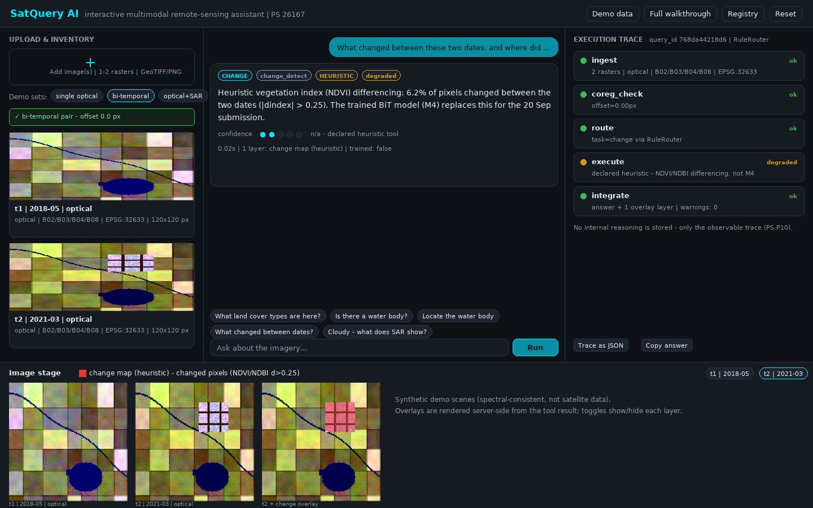

# SatQuery AI — SIH 2026 · PS 26167 (ISRO)

**An interactive, agentic vision-language assistant for multimodal remote-sensing image analysis through text queries.**
Given one or two co-registered rasters (optical, SAR, or a bi-temporal pair) and a natural-language question, SatQuery AI
plans over a *predefined registry* of specialist tools, executes only permitted parameters, and returns every answer with an
**auditable execution trace**, calibrated confidence, visual overlay evidence and a downloadable report. Single-image
VQA/captioning is the mandatory baseline; the principal focus is joint reasoning over optical + SAR and multitemporal pairs.



## Run the prototype

```bash
cd prototype
pip install -r requirements-serve.txt        # pinned; core + web app + tests
pytest                                       # 48 tests, no GPU/weights needed
uvicorn satquery.web_server:app --host 0.0.0.0 --port 8000   # open http://localhost:8000
```

Full details — what is real vs. heuristic, enabling the BigEarthNet-pretrained land-cover model, REST API, Window B swap-in
points — are in **[`prototype/README.md`](prototype/README.md)**.

## Repository map

| Path | Purpose |
|---|---|
| [`ps-26167.md`](ps-26167.md) | Official problem statement, clause-by-clause (P1–P15) — **source of truth** |
| [`proposedidea.md`](proposedidea.md) | Solution summary and scope decisions for the 5 Sep pitch / 20 Sep submission |
| [`architecture.md`](architecture.md) · [`design.md`](design.md) | System/model architecture · UI, API, report and schema design |
| [`checkpoints.md`](checkpoints.md) · [`budget.md`](budget.md) | Compliance matrix, schedule, team roles · ₹0 build/deploy plan |
| [`prototype/`](prototype/) | Runnable code: ingestion, registry, router, orchestrator, SQLite trace, FastAPI web app, tests |
| [`SatQuery-AI-SIH2026-Idea-Deck-v2.pptx`](SatQuery-AI-SIH2026-Idea-Deck-v2.pptx) · [`.pdf`](SatQuery-AI-SIH2026-Idea-Deck-v2.pdf) | **Idea-submission deck** (6 slides, official template). Upload the PDF; the PPTX is the editable master. Supersedes `SatQuery-AI-SIH2026-Idea-Deck.*` |
| [`docs/sih-winning-deck-analysis.md`](docs/sih-winning-deck-analysis.md) | Structural/visual patterns mined from a winning SIH idea deck + how this deck applies them, and the pre-upload checklist |
| [`docs/`](docs/) | Screenshots (regenerate with `python prototype/scripts/make_readme_screenshot.py`) |

Doc precedence when in doubt: `ps-26167.md` › `budget.md` (hardware/deploy) › `architecture.md`.
